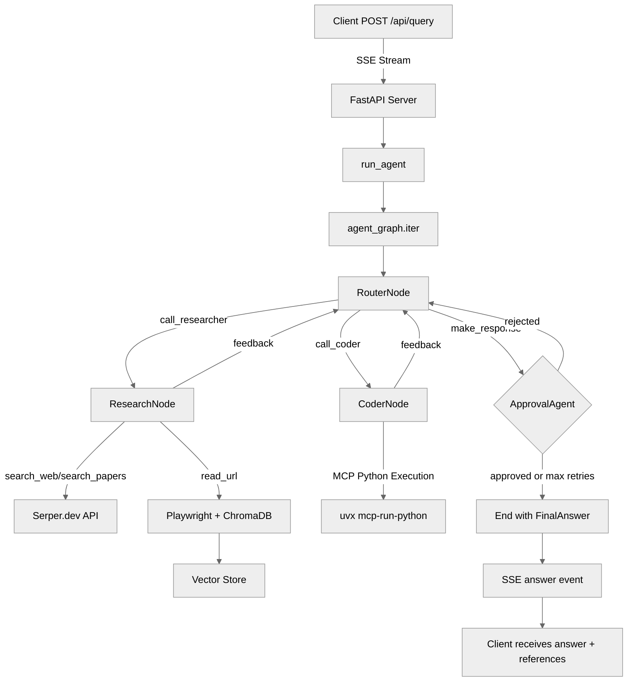

# Librarian

A local AI research assistant. Ask questions and get answers backed by real web
sources.

## Features

- Web search with cited references
- Reads web pages and PDFs
- Bookmark groups to scope searches to specific sites
- Optional local LLM inference via vLLM, or point it at any OpenAI-compatible
  endpoint
- URL document cache (ChromaDB) so pages aren't re-fetched on follow-up
  questions

## Requirements

- [uv](https://docs.astral.sh/uv/) — Python environment manager
- [Deno](https://deno.com/) — frontend and launcher runtime
- [Serper](https://serper.dev) API token — web search
- A vLLM-compatible endpoint (local or remote)

> **Local vLLM** requires Linux with an NVIDIA GPU. If you're running vLLM on
> another machine, just point `VLLM_BASE_URL` at it and skip the local vLLM
> setup.

## Setup

### 1. Environment variables

```sh
export SERPER_API_TOKEN=...             # from serper.dev (required)
export VLLM_BASE_URL=http://localhost:8000/v1
export VLLM_MODEL_NAME=Qwen/Qwen3-VL-8B-Thinking-FP8
export VLLM_API_KEY=any-value          # required but can be any non-empty string
export HF_TOKEN=...                    # optional, only needed for gated Hugging Face models
```

### 2. Install dependencies

```sh
cd api
uv sync
uv run playwright install firefox
```

### 3. Start

```sh
deno task start
```

On first run, your browser opens to a setup page where you can configure port
numbers and whether to start vLLM locally. The config is saved to
`librarian.config.json`. To reconfigure later, delete that file and run
`deno task start` again, or visit `/setup`.

## Running vLLM locally

If you chose to manage vLLM yourself rather than through the launcher:

```sh
cd api
uv run --with vllm==0.13 vllm serve $VLLM_MODEL_NAME \
  --port 8000 \
  --api-key $VLLM_API_KEY
```

## Development

Frontend (hot reload):

```sh
deno task dev:web
```

Backend:

```sh
cd api
uv run python -m librarian.server --port 8001
```

## CLI

Run a one-off query without the web UI:

```sh
cd api
uv run python librarian/agent.py -q "Your question here" -r 2
```

Options:

- `-q`, `--query` — the question to answer
- `-r`, `--references_required` — minimum number of source URLs (default: 1)

## Data & Storage

Visited URLs are chunked, embedded, and stored in a ChromaDB vector database at
`api/url_store/`. This cache persists across restarts — pages already visited
won't be re-fetched. Delete the `url_store/` directory to clear it.

## Keyboard Shortcuts

| Key       | Action                         |
| --------- | ------------------------------ |
| `Enter`   | Submit query                   |
| `↑` / `↓` | Navigate query history         |
| `Ctrl+Z`  | Scroll input into view         |
| `Ctrl+R`  | Clear chat history and session |

## API

### `POST /api/query`

Stream agent responses as Server-Sent Events.

```json
{
  "query": "What is the Higgs boson?",
  "session_id": "optional-uuid",
  "allowed_sites": ["arxiv.org", "en.wikipedia.org"],
  "references_required": 2,
  "baseline_thinking_effort": 5,
  "dynamic_thinking_effort": true
}
```

SSE event types:

| Event    | Data                                          |
| -------- | --------------------------------------------- |
| `node`   | `{ "node_type": "ResearchNode", "data": {} }` |
| `answer` | `{ "answer": "...", "references": ["..."] }`  |
| `error`  | `{ "message": "..." }`                        |

### `DELETE /api/session/{session_id}`

Clear a session's conversation history.

## Agent Workflow


