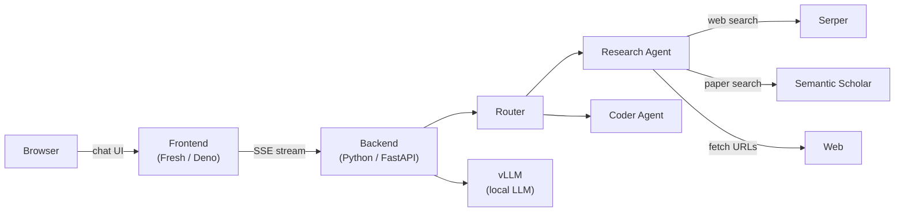

# Librarian

A local AI research assistant. Ask it questions; it searches the web and academic papers, reasons over the results, and gives you a cited answer.

## Features

- **Agentic research** — routes queries to a research agent that searches, reads, and synthesizes sources before answering
- **Web + paper search** — searches the web via [Serper](https://serper.dev) and academic papers via Semantic Scholar
- **Cited answers** — every answer includes references to the sources used
- **Bookmark groups** — pin specific sites so the agent always searches them
- **Conversation memory** — follow-up questions build on previous answers within a session
- **Configurable thinking effort** — tune how deeply the model reasons per query
- **Local LLM** — powered by [vLLM](https://github.com/vllm-project/vllm); your data stays on your machine

## Architecture



## Prerequisites

| Tool | Purpose |
|------|---------|
| [Deno](https://deno.com) v2+ | Launcher and frontend |
| [Python](https://python.org) 3.12+ + [uv](https://docs.astral.sh/uv/) | Backend |
| [vLLM](https://github.com/vllm-project/vllm) >= 0.13 | LLM inference — **you must start this yourself** |
| [Serper](https://serper.dev) API key | Web search |

## Quick Start

**1. Start vLLM**

Librarian requires vLLM >= 0.13 started **without a reasoning parser**:

```sh
vllm serve $VLLM_MODEL_NAME \
  --api-key $VLLM_API_KEY \
  --enable-auto-tool-choice \
  --tool-call-parser hermes \
  --gpu-memory-utilization 0.92 \
  --max-model-len auto
```

> Hermes-format tool calling is required. The `--tool-call-parser` flag must be set, but `--reasoning-parser` must **not** be set.

**2. Set environment variables**

Create a `.env` file:

```sh
VLLM_BASE_URL=http://localhost:8000/v1
VLLM_API_KEY=your-vllm-key
VLLM_MODEL_NAME=your-model-name
SERPER_API_TOKEN=your-serper-key
```

**3. Clone and launch**

```sh
git clone https://github.com/g-eoj/librarian.git && cd librarian
source .env && deno task start
```

Open http://localhost:8080 in your browser.

## Configuration

Port numbers are saved to `librarian.config.json` on first run. To change them, delete the file and re-run `deno task start`.

| Service | Default port |
|---------|-------------|
| Frontend | 8080 |
| Backend | 8001 |

## Development

See [`api/`](api/) and [`web/`](web/) for backend and frontend developer docs.

```sh
deno task dev:web    # Frontend dev server with hot reload
```

## License

Apache 2.0 — see [LICENSE](LICENSE).
