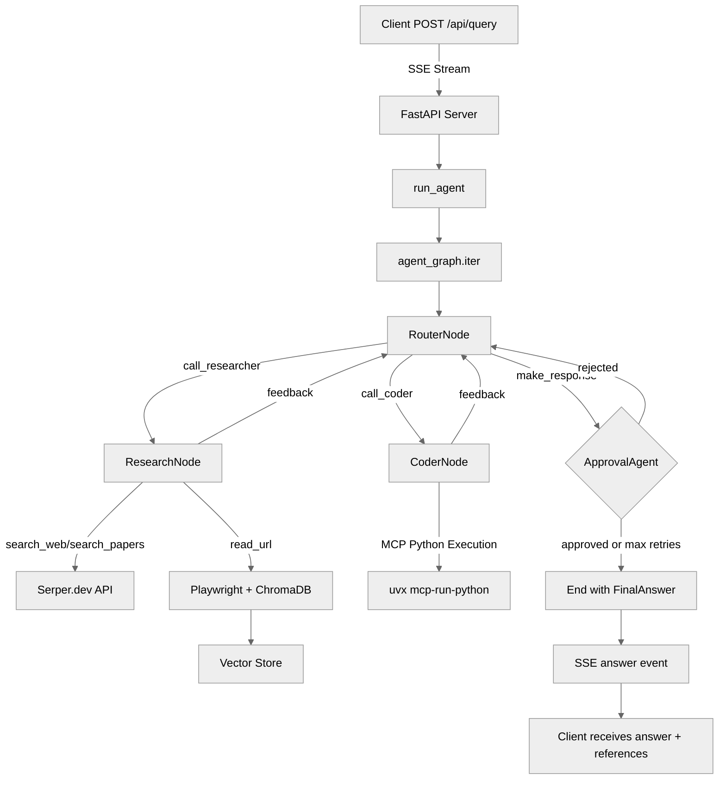

# Librarian API

FastAPI backend for the Librarian AI research assistant. Runs an agentic workflow that searches the web, reads pages, and runs Python code to answer questions.

## Features

- Web and academic paper search with cited references
- Reads web pages and PDFs via Playwright (Firefox + pdf.js)
- Python execution via MCP for computations and simulations
- Self-reviewing answers — the router critiques its own responses before
  returning them
- LLM inference via vLLM or any OpenAI-compatible endpoint
- URL document cache (ChromaDB with cosine similarity) so pages aren't
  re-fetched on follow-up questions
- Per-session message history for multi-turn conversations

## Architecture

The API is built on [pydantic-graph](https://ai.pydantic.dev/graph/) with three nodes that cycle until an answer is produced:

- **RouterNode** — orchestrates the workflow; decides whether to call the researcher or coder; self-reviews answers before finalizing
- **ResearchNode** — searches the web and academic papers via Serper.dev, fetches pages with Playwright, chunks and stores content in ChromaDB, returns notes with source references
- **CoderNode** — runs Python via an MCP subprocess to compute results

The LLM is served locally via vLLM (OpenAI-compatible API).

## Agent Workflow



## Setup

Requires Python 3.12+ and [uv](https://docs.astral.sh/uv/).

```sh
cd api
uv sync
uv run playwright install firefox
```

### Environment Variables

| Variable | Description | Required |
|---|---|---|
| `VLLM_BASE_URL` | vLLM API base URL | Yes |
| `VLLM_API_KEY` | vLLM API key | Yes |
| `VLLM_MODEL_NAME` | Model name served by vLLM | Yes |
| `SERPER_API_TOKEN` | Serper.dev API key for web search | Yes |
| `HF_TOKEN` | Hugging Face token (for gated models) | No |

Variables are defined in [`env.schema.json`](../env.schema.json) at the repository root.

## Running

```sh
cd api
uv run python -m librarian.server
# or with options:
uv run python -m librarian.server --port 8001 --host 0.0.0.0
```

Default port is `8001`.

## API

### `GET /api/health`

Returns vLLM connectivity status.

```json
{"vllm": true, "vllm_url": "http://localhost:8000"}
```

### `POST /api/query`

Streams a research response as [Server-Sent Events](https://developer.mozilla.org/en-US/docs/Web/API/Server-sent_events).

**Request body:**
```json
{
  "query": "string",
  "session_id": "optional uuid — omit to start a new session",
  "allowed_sites": ["example.com"],
  "references_required": 1,
  "baseline_thinking_effort": 5,
  "dynamic_thinking_effort": true
}
```

**SSE events:**

| Event | Data |
|---|---|
| `node` | `{"node_type": "RouterNode" \| "CoderNode" \| "ResearchNode", "data": {...}}` |
| `answer` | `{"answer": "...", "references": ["url", ...]}` |
| `error` | `{"message": "..."}` |

The response includes an `X-Session-Id` header with the active session ID.

### `DELETE /api/session/{session_id}`

Clears conversation history for a session.

## Development

```sh
cd api
uv run pytest       # run tests
uv run ruff check   # lint
```
